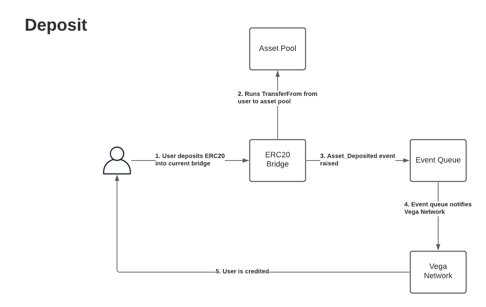
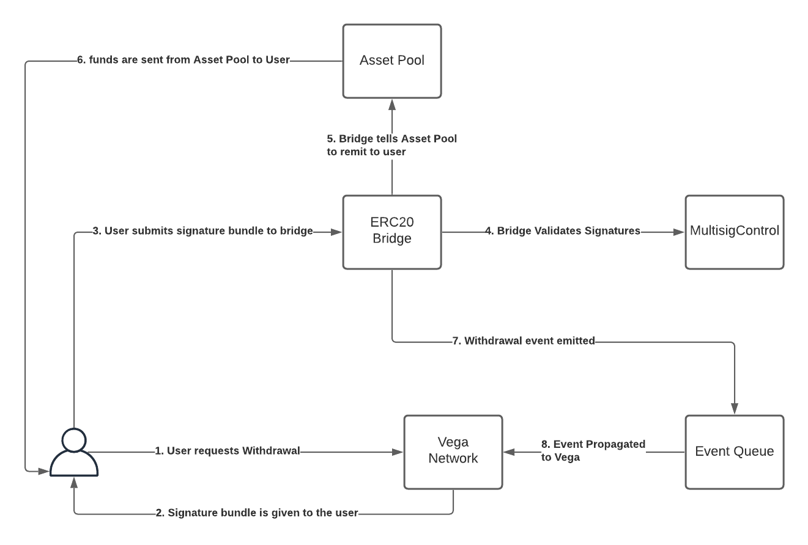
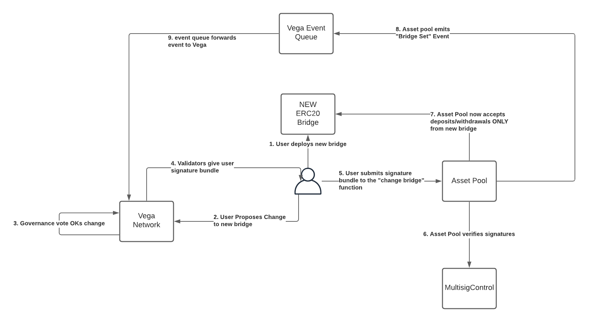
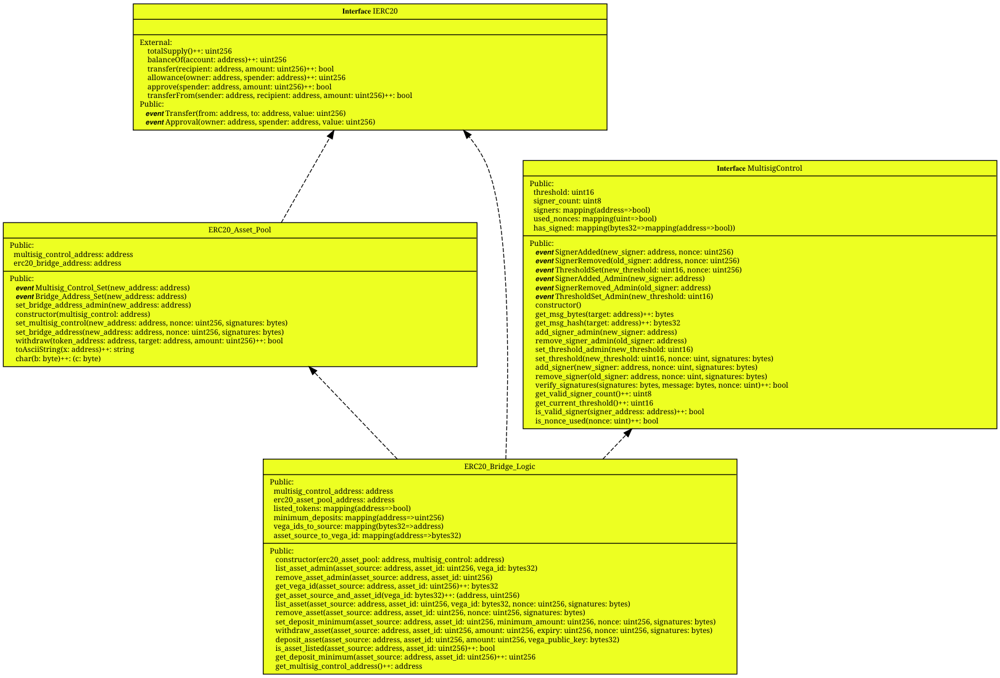

# MultisigControl
This repository contains the Ethereum side of the Ethereum bridge to Vega.

## Basic structure
The bridge is comprised of a smart contract per asset class, and a generic asset pool. For example, when a user wants to deposit collateral in to a Vega network, they deposit an approved ERC20 token to the ERC20 bridge contract for the appropriate network. This is held in the asset pool contract, and the user's collateral is reflected in the Vega network:

For a more specific walkthrough, and find the ABIs & addresses for the Vega testnet, see [Public_Test_Bridge_Tools](https://github.com/vegaprotocol/Public_Test_Bridge_Tools).

### Withdrawal
Withdrawal is a slightly more complex process, as it requires gathering a signed multisig bundle from the validators on that Vega network, which the user then submits to the ERC20 bridge. This extra step is required so that the network can verify that the collateral exists in the network and is not allocated to the user's margin account.

## Upgrading bridge contract for a running Vega network

As the asset pool is a separate contract, it's possible to update the ERC20 bridge contract for a running network without impacting the collateral held for users of the network. The process is outlined below, and requires a user to propose a governance action on Vega, before submitting a multisig bundle to the asset pool contract.

See below for instructions on how to complete step 1.

# Structure

## Local Ganache Deployment
Terminal 1:

1. `npm install`
1. `ganache-cli -m "cherry manage trip absorb logic half number test shed logic purpose rifle"`

Terminal 2:

1. `truffle migrate` This deploys MultisigControl, Asset Pool, and 2 bridge logic contracts
1. `cd TESTNET_ASSET_DEPLOYMENT`
1. `truffle migrate` This deploys the tokens
1. `node confgure_assets.js` This will list the tokens on the bridge logic 1 contract
1. `node confgure_signers.js` This will set the contract to the initial signer for bootstrapping
1. `node confgure_asset_pool.js` This will finish bridge setup

All addresses, ABIs, and smart contract files will be available in `./ropsten_deploy_details/local`

## Ropsten Deployment [test|stag|dev]

1. `truffle migrate --network ropsten --vega [test|stag|dev]` (without brackets so `--network ropsten --vega test`) This deploys MultisigControl, Asset Pool, and 2 bridge logic contracts
1. `cd TESTNET_ASSET_DEPLOYMENT`
1. `truffle migrate --network ropsten --vega [test|stag|dev]` This deploys the tokens
1. `node confgure_assets.js --network ropsten --vega [test|stag|dev]` This will list the tokens on the bridge logic 1 contract
1. `node confgure_signers.js --network ropsten --vega [test|stag|dev]` This will set the contract to the initial signer for bootstrapping
1. `node confgure_asset_pool.js --network ropsten --vega [test|stag|dev]` This will finish bridge setup
Done.

All addresses, ABIs, and smart contract files will be available in `./ropsten_deploy_details/[test|stag|dev]`

## Run in Docker

See [Dockerised Vega](https://github.com/vegaprotocol/devops-infra/blob/master/doc/dockerisedvega.md).

# See Also

* https://github.com/vegaprotocol/Public_Test_Bridge_Tools
* https://vega.xyz
* https://docs.testnet.vega.xyz
