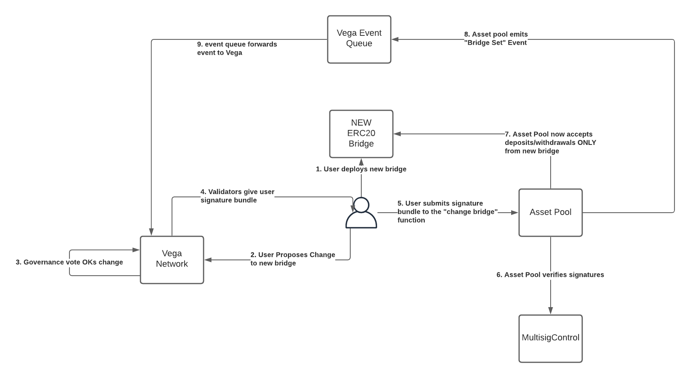

# MultisigControl
This repository contains the Ethereum side of the Ethereum bridge to Vega.

## Basic structure

## Upgrading bridge contract for a running Vega network

As the asset pool is a separate contract, it's possible to update the ERC20 bridge contract for a running network without impacting the collateral held for users of the network. The process is outlined below, and requires a user to propose a governance action on Vega, before submitting a multisig bundle to the asset pool contract.

See below for instructions on how to complete step 1.

## Local Ganache Deployment
Terminal 1:

1. `npm install`
1. `ganache-cli -m "cherry manage trip absorb logic half number test shed logic purpose rifle"`

Terminal 2:

1. `truffle migrate` This deploys MultisigControl, Asset Pool, and 2 bridge logic contracts
1. `cd TESTNET_ASSET_DEPLOYMENT`
1. `truffle migrate` This deploys the tokens
1. `node confgure_assets.js` This will list the tokens on the bridge logic 1 contract
1. update `TESTNET_ASSET_DEPLOYMENT/bot_configs.json` with the contents of `https://bots.vegaprotocol.io/devnet/traders-settlement`
1. `node bot_fillup.js` this will issue tokens to the bots from the previous step, in the amounts set in `TESTNET_ASSET_DEPLOYMENT/bot_fillup.js` 

Done. Bots should be loaded.

All addresses, ABIs, and smart contract files will be available in `./ropsten_deploy_details/local` 

## Ropsten Deployment [test|stag|dev]

1. `truffle migrate --network ropsten --vega [test|stag|dev]` (without brackets so `--network ropsten --vega test`) This deploys MultisigControl, Asset Pool, and 2 bridge logic contracts
1. `cd TESTNET_ASSET_DEPLOYMENT`
1. `truffle migrate --network ropsten --vega [test|stag|dev]` This deploys the tokens
1. `node confgure_assets.js --network ropsten --vega [test|stag|dev]` This will list the tokens on the bridge logic 1 contract
1. update `TESTNET_ASSET_DEPLOYMENT/bot_configs.json --network ropsten --vega [test|stag|dev]` with the contents of `https://bots.vegaprotocol.io/devnet/traders-settlement`
1. `node bot_fillup.js` this will issue tokens to the bots from the previous step, in the amounts set in `TESTNET_ASSET_DEPLOYMENT/bot_fillup.js` 

Done. Bots should be loaded.

All addresses, ABIs, and smart contract files will be available in `./ropsten_deploy_details/[test|stag|dev]`

## Run in Docker

See [Dockerised Vega](https://github.com/vegaprotocol/devops-infra/blob/master/doc/dockerisedvega.md).
